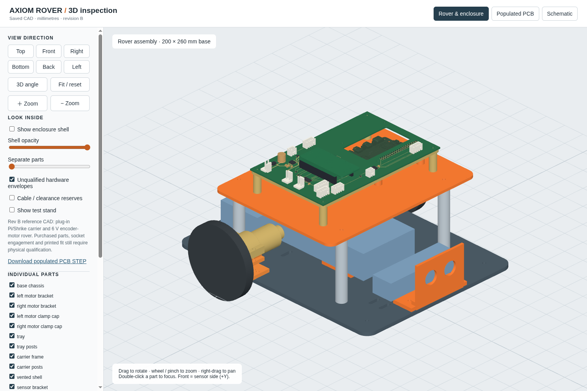

# Axiom Rover

**Interactive 3D inspection:** [open the local viewer](http://127.0.0.1:8765/viewer/) — rotate, zoom, inspect all sides, hide the shell, or separate parts. [Start/restart instructions](viewer/README.md).

A reusable 2WD release-test robot: one fixed Shrike/RP2040 + ForgeFPGA actuator base, a removable compute tray, an independent motor-power stop, and a wheels-raised stand. This is an **independent hardware repository**, not part of the AxiomOS source tree.

**Revision B is a design-review prototype, not released for fabrication or powered motion.** The carrier now has a bottom Pi 5 socket, two top Shrike R0.4 sockets, an onboard DRV8833 motor driver, and HC-SR04, wheel-encoder and IMU connectors. Vendor CAD and nominal socket models establish design coordinates; physical fit and powered tests remain outstanding.

- [Editable KiCad project](electronics/carrier.kicad_pro), [schematic](electronics/carrier.kicad_sch), [routed PCB](electronics/carrier.kicad_pcb), and [schematic drawing](electronics/out/schematic/carrier.svg).
- [Parametric mechanical source](mechanical/axiom_rover.py), [STEP assembly](mechanical/out/axiom_rover_assembly.step), and individual STL parts in [mechanical/out](mechanical/out/).
- [Electrical and harness contract](docs/electrical-contract.md), [wiring diagram](docs/harness.svg), [mechanical interfaces](docs/mechanical.md), [system BOM](bom/system-bom.csv).
- [Assembly, procurement and commissioning](docs/commissioning.md), [post-v1.0 compute roadmap](docs/compute-roadmap.md), [reproduction instructions](docs/build.md).
- [Native electrical check results](electronics/out/drc.json), [mechanical checks](mechanical/out/mechanical_checks.json), [populated assembly checks](mechanical/out/assembly-fit.json), [34 browser checks](viewer/browser-check.json), and [release gates](release-gates.json).

The carrier is 160 × 100 × 1.6 mm, two layers, with a cooler aperture. The Pi sits below it at a 16.5 mm gap and Shrike plugs into two 19-position sockets above. Two 6 V ThinkRobotics MOT3001-6V60RPM encoder motors drive 80 mm Pololu 3690 wheels. DRV8833 current regulation targets 1 A per channel; actual current and thermal behavior require bench measurements. The external fuse, normally-open motor-power relay, regulated motor source and separate host/base supplies remain off-board. Power down before compute swaps; J1 and alternate-host J12 cannot be used together.

A robot supplies repeatable evidence for named releases and fault cases. It cannot prove AxiomOS correct under every possible condition. Every physical result must identify the software/FPGA hashes, hardware revision, power state and raw capture.

Budget cap: ₹30,000 excluding compute boards and instruments, with ₹6,000 reserved for a revision. The current estimate is ₹20,821.98–₹45,459.98 before reserve (₹26,821.98–₹51,459.98 including it), not a vendor quote. First-order quotes must total at most ₹24,000 before ordering. Nothing has been purchased, fabricated, flashed or physically tested here.
