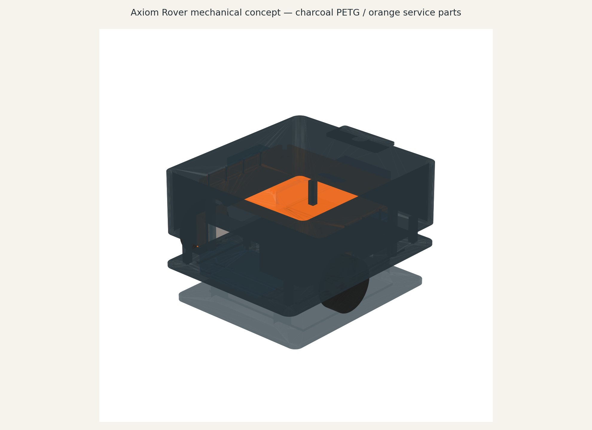

# Axiom Rover

A reusable 2WD release-test robot: one fixed Shrike/RP2040 + ForgeFPGA actuator base, a removable compute tray, an independent motor-power stop, and a wheels-raised stand. This is an **independent hardware repository**, not part of the AxiomOS source tree.

**Revision A is a design-review prototype, not released for fabrication or powered motion.** Native KiCad checks and CAD geometry checks are reproducible. Purchased-part dimensions, the FPGA bitstream/runtime, motor power ratings, thermal performance and physical measurements still need qualification.

- [Editable KiCad project](electronics/carrier.kicad_pro), [schematic](electronics/carrier.kicad_sch), [routed PCB](electronics/carrier.kicad_pcb), and [schematic drawing](electronics/out/schematic/carrier.svg).
- [Parametric mechanical source](mechanical/axiom_rover.py), [STEP assembly](mechanical/out/axiom_rover_assembly.step), and individual STL parts in [mechanical/out](mechanical/out/).
- [Electrical and harness contract](docs/electrical-contract.md), [mechanical interfaces](docs/mechanical.md), [system BOM](bom/system-bom.csv).
- [Assembly, procurement and commissioning](docs/commissioning.md), [post-v1.0 compute roadmap](docs/compute-roadmap.md), [reproduction instructions](docs/build.md).
- [Native electrical check results](electronics/out/drc.json), [mechanical checks](mechanical/out/mechanical_checks.json), and [release gates](release-gates.json).

The carrier is 120 × 80 mm, two layers, 1.6 mm FR-4. It carries signals and sensor power only. Motors, the L298N power stage, fuse, DC-rated relay and batteries remain off-board. J1 uses `HOST_3V3/H_GND/H_TX/H_RX` across a split-supply digital isolator; power down before changing trays. The host and base have no carrier ground tie.

A robot supplies repeatable evidence for named releases and fault cases. It cannot prove AxiomOS correct under every possible condition. Every physical result must identify the software/FPGA hashes, hardware revision, power state and raw capture.

Budget target: ₹15,000–₹30,000 for one outsourced prototype, excluding compute boards and instruments. The current BOM estimate is ₹19,862–₹38,475, not a purchase quote. Its upper end exceeds the target; vendor quotes must reconcile the total and the desired ₹6,000 revision reserve before ordering. Nothing has been purchased, fabricated, flashed or physically tested by this repository's creation.
